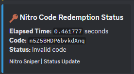
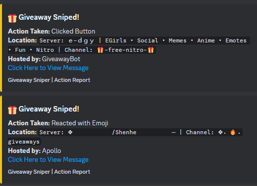
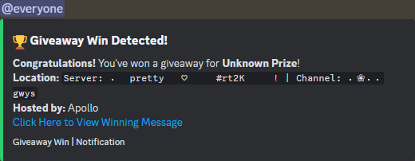
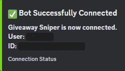

# 🎁 **Discord Giveaway and Nitro Sniper Selfbot** 🚀  


## **Overview - The Ultimate Discord Automation Tool**  

Welcome to the **Discord Giveaway and Nitro Sniper Selfbot**, your one-stop solution for **automating Discord giveaways** and **sniping Discord Nitro codes** instantly! 🎉  

Built with cutting-edge **anti-detection features**, **real-time notifications**, and **intelligent error handling**, this selfbot allows you to maximize your chances of:  
- Winning **Discord Giveaways** effortlessly.  
- Sniping and redeeming **Discord Nitro gift codes** faster than anyone.  

⚠️ **Disclaimer**: Selfbotting is against **Discord's Terms of Service**, and misuse can lead to account suspension or bans. Use this tool **responsibly and at your own risk**.  

---

## **Key Features - Why Choose This Selfbot?** 🌟  

### 🎉 **Automatic Discord Giveaway Participation**  
- Instantly reacts to giveaways with 🎉 emoji or **clicks interactive buttons**.  
- Skips blacklisted giveaways using **custom keyword filtering** to avoid fake or spammy giveaways.  
- Ensures you're entered into **every legitimate giveaway** to maximize wins.  

### ⚡ **Discord Nitro Code Sniper**  
- Monitors Discord servers for **Nitro gift codes** (e.g., `discord.gift/...`).  
- Automatically redeems codes **in milliseconds** for the fastest sniping experience.  
- Intelligent error handling and retries ensure **maximum efficiency** even during rate limits.  

### 🕵️ **Stealth and Anti-Detection**  
- Randomizes **User-Agents** and **device IDs** for each action.  
- Mimics legitimate client activity with dynamic **HTTP headers** and rate-limit handling.  
- Protects your account from being flagged or detected with **human-like reaction delays**.  

### 🔔 **Webhook Notifications for Wins and Events**  
- Sends **real-time alerts** to a configurable webhook about:  
   - Successful **Nitro redemptions**.  
   - Giveaway wins.  
   - Bot connection status and updates.  
- Notifications now include **detailed embeds** with actionable insights.  

### 📜 **Comprehensive Logging**  
- Logs every action to both the **console** and `logs.txt` file for easy tracking.  
- Introduced **rate-limited logging** to prevent spam in logs while maintaining transparency.  

### 🔧 **Highly Customizable**  
- Full control via `config.json` for settings like:  
   - Discord **token**, **blacklist**, **webhook notifications**, and **device identifiers**.  
- Introduced **GiveawayBlacklist** to avoid unwanted giveaways by filtering keywords.  

### 🔍 **Advanced Detection Algorithms**  
- Detects giveaways from **message content**, **embeds**, and **interactive components**.  
- Snipes Nitro codes posted in **messages or embeds**.  
- Redesigned giveaway and Nitro detection logic for **improved accuracy**.  

### 🔒 **Error Handling and Restart Mechanism**  
- Automatically restarts the bot in case of critical errors.  
- Redesigned error messages for clarity and debugging efficiency.  

---

## **Who Should Use This Selfbot?**  

This tool is ideal for:  
- **Discord Nitro enthusiasts** looking to grab **free Nitro codes** instantly.  
- Users interested in **winning Discord giveaways** efficiently.  
- Developers and testers learning about **Discord automation** and **anti-detection techniques**.  

---

## **Installation - Get Started in Minutes** ⏱️  

Follow these easy steps to install and run the bot:  

### 1️⃣ **Clone the Repository**  
```bash  
git clone https://github.com/kubaam/Discord-Giveaway-and-Nitro-Sniper-Selfbot  
cd Discord-Giveaway-and-Nitro-Sniper-Selfbot  
```  

### 2️⃣ **Install Dependencies**  
Make sure you have **Python 3.8+** installed, then run:
```bash  
pip install -r requirements.txt  
```  

### 3️⃣ **Configure the Bot**
- Create `config.json` in the project root (or update the existing file) and fill in your account details.
- **One account must be marked as `"is_main": true`**. Additional feeder accounts can set `"is_feeder": true` to snipe codes on behalf of the main profile.
- Provide a realistic `user_agent` and `device_id` for every account to reduce detection risk.
- Optional settings let you fine-tune webhook notifications, giveaway filtering, Nitro rate limits, and invite sniping.

Example `config.json` aligned with the current schema:
```json
{
  "accounts": [
    {
      "token": "MAIN_ACCOUNT_TOKEN",
      "is_main": true,
      "is_feeder": false,
      "proxy_url": null,
      "user_agent": "Mozilla/5.0 (Windows NT 10.0; Win64; x64) AppleWebKit/537.36 (KHTML, like Gecko) Chrome/125.0.0.0 Safari/537.36",
      "device_id": "8a3f53cf8f7c4e5ca2f8a54acb861234"
    },
    {
      "token": "FEEDER_ACCOUNT_TOKEN",
      "is_main": false,
      "is_feeder": true,
      "proxy_url": "http://127.0.0.1:8080",
      "user_agent": "Mozilla/5.0 (Macintosh; Intel Mac OS X 13_5_0) AppleWebKit/605.1.15 (KHTML, like Gecko) Version/17.0 Safari/605.1.15",
      "device_id": "5b86d1f733e14bd0aa529cc77e4a2b1f"
    }
  ],
  "webhook_url": "https://discord.com/api/webhooks/...",
  "webhook_notifications": true,
  "bot_author_blacklist": [
    432610292342587392,
    1156418379050127430
  ],
  "nitro_settings": {
    "max_concurrent_snipes": 5,
    "request_timeout": 8.0,
    "max_retries": 3
  },
  "giveaway_settings": {
    "min_delay_sec": 2.5,
    "max_delay_sec": 7.0,
    "dm_message": "Thanks for hosting!",
    "global_blacklist_keywords": [
      "test",
      "fake"
    ],
    "server_specific_rules": {
      "123456789012345678": {
        "whitelist": [
          "nitro"
        ],
        "blacklist": [
          "bot"
        ]
      }
    }
  },
  "invite_sniper_settings": {
    "enabled": false,
    "min_member_count": 50,
    "max_member_count": 50000,
    "server_blacklist_ids": [],
    "max_joins_per_hour": 5
  }
}
```

### Configuration Reference

| Section | Purpose | Key Fields |
| --- | --- | --- |
| `accounts[]` | Defines each Discord user the selfbot will control. Exactly one `is_main` account is required; feeder accounts forward redeemed Nitro to the main profile. | `token`, `is_main`, `is_feeder`, `proxy_url`, `user_agent`, `device_id` |
| `webhook_url` & `webhook_notifications` | Enables rich Discord webhook alerts for wins, snipes, and errors. | URL string, boolean toggle |
| `bot_author_blacklist` | Skips messages authored by listed bot IDs to avoid false positives. | Array of Discord user IDs |
| `nitro_settings` | Controls the Nitro redemption worker pool and retry policy. | `max_concurrent_snipes`, `request_timeout`, `max_retries` |
| `giveaway_settings` | Configures reaction delays, DM messages, and keyword filters. | `min_delay_sec`, `max_delay_sec`, `dm_message`, `global_blacklist_keywords`, `server_specific_rules` |
| `invite_sniper_settings` | Optional module that auto-joins servers that meet your criteria. | `enabled`, `min_member_count`, `max_member_count`, `server_blacklist_ids`, `max_joins_per_hour` |

### 4️⃣ **Run the Selfbot**
Start the bot with:
```bash
python main.py
```
or use the provided launch scripts, which automatically manage a virtual environment and install dependencies:

- **Windows:** `launch.bat`
- **Linux/macOS:** `./launch.sh`

If startup fails with a configuration error, double-check that your JSON matches the schema described above and that every account includes a unique token, user agent, and device ID.

## Architecture Overview

```
Message -> on_message -> check_nitro_codes / check_giveaway_message
        \-> redeem_nitro_code -> webhook_notifier
```

---

## **How It Works - Key Functionalities Explained** 🔑

### **⚡ Discord Nitro Sniping**  
- Detects Nitro codes like `discord.gift/xyz123`.  
- Automatically redeems the code in milliseconds, maximizing your chance of success.  
- Redesigned error handling ensures the bot can recover from rate limits and other issues.  

### **🎉 Giveaway Sniping**  
- Scans for giveaway messages with keywords like `🎁`, `Ends at`, or `Winners:`.  
- Reacts with 🎉 emoji or clicks giveaway buttons to enter seamlessly.  
- Skips blacklisted giveaways using the `GiveawayBlacklist` configuration.  

### **🕵️ Anti-Detection Measures**  
- Randomizes User Agents and HTTP headers.  
- Handles **rate limits** intelligently using exponential retries.  
- Changes device fingerprints for every request.  
- Introduced **human-like delays** for reactions to mimic user behavior.  

### **🔔 Webhook Alerts**  
Get instant updates for:  
- **Nitro redemption status** (success, invalid, or already claimed).  
- **Giveaway wins** with message links and prize details.  
- Redesigned notifications with **detailed embeds** and dynamic content.  

### **🔒 Rate-Limited Logging**  
- Limits repetitive logging to prevent spam and ensure readability.  
- Tracks every major event, including giveaways, Nitro attempts, and errors.  

---

## **Screenshots - See It in Action** 📸  

### 🔑 **Nitro Redemption Notification**  
  

### 🎉 **Giveaway Participation Alert**  
  

### 🏆 **Giveaway Win Notification**  
  

### ✅ **Bot Connected**  
  

### ▶️ **Bot Running in Windows CMD**  
  

---

## **Advanced Features for Pro Users** 💎  

- **Blacklisted Keywords**: Avoid giveaways containing fake or spammy content.  
- **Rate-Limited Logging**: Prevent log spam with intelligent rate-limiting.  
- **Detailed Webhook Reports**: Get actionable insights into bot performance.  
- **Improved Error Handling**: Robust error messages and automated restarts for seamless operation.  

---

## **Disclaimer - Use Responsibly** ⚠️  

⚠️ **Using this selfbot violates Discord's Terms of Service**.  
- It can result in **account suspension** or permanent bans.  
- Use only on secondary accounts that you can afford to lose.  
- The author takes **no responsibility** for misuse.  

---


## **Support and Contributions** 🤝  

Feel free to contribute or report bugs via GitHub. Pull requests are welcome!  
If you appreciate this tool, you can support its development by donating here:  
[**PayPal - Jakub Ambrus**](https://paypal.me/JakubAmbrus)  

---

## **License** 📜  

This project is licensed under the **MIT License**. See `LICENSE` for details.  

---

<!--
- Discord Giveaway Sniper
- Discord Nitro Sniper
- Best Discord Nitro Sniper
- Nitro Sniper Bot for Discord
- Discord Giveaway Bot
- Automated Giveaway Entry Bot
- Fastest Nitro Sniper Tool
- Free Discord Nitro Codes Bot
- Nitro Code Redeemer for Discord
- Discord Selfbot for Nitro
- Discord Nitro Sniper Free Download
- Discord Giveaway Auto-Joiner
- Discord Selfbot with Nitro Features
- Discord Tools for Nitro Sniping
- Advanced Nitro Sniper 2024
- Discord Nitro Claim Bot
- Discord Automation Bot
- Discord Giveaway Automation
- Fast Nitro Code Redeemer Bot
- Discord Giveaway Winner Tool
- Auto Join Giveaway Discord Bot
- Discord Selfbot for Giveaways
- Nitro Redeemer Selfbot 2024
- Best Discord Giveaway Sniper Bot 2024
- How to Snipe Nitro Codes on Discord
- Fastest Discord Nitro Bot for Giveaways
- Automated Giveaway Sniper for Discord Servers
- Discord Giveaway Tool for Nitro Codes
- Claim Discord Nitro Codes Automatically
- How to Redeem Nitro Codes Quickly
- Free Discord Nitro Codes 2024
- Nitro Giveaway Sniping Tutorial
- Best Selfbot for Discord Nitro Sniping
- How to Auto Join Giveaways on Discord
- Discord Nitro Code Giveaway Tool
- Discord Nitro Sniper Safe to Use
- Best Free Discord Nitro Sniper Tool
- Discord Nitro Sniper Features Explained
- Discord Nitro Claiming Bot Guide
- Discord Giveaway Sniper 2024 Download
- Discord Nitro Giveaway Sniper Bot
- Automated Discord Nitro Redeemer
- Nitro Code Sniper 2024
- Discord Giveaway Tool for Gamers
- Discord Nitro Giveaway Winner Bot
- Fast Discord Giveaway Sniper Software
- Discord Nitro Redeemer Tool Free
- Discord Bot for Giveaway Auto Entry
- Discord Nitro Sniper Hacks
- Automated Discord Giveaway Entries
- Best Nitro Sniper Tools
- Discord Giveaway Strategies
- Win Discord Nitro Fast
- Discord Bot for Nitro Sniping
- How to Snipe Discord Giveaways
- Top Discord Giveaway Servers
- Nitro Sniper Success Stories
- Discord Giveaway Tips and Tricks
- Discord Nitro Sniper Scripts
- Free Discord Nitro Sniper Download
- Discord Giveaway Entry Automation
- Nitro Sniper Bot Open Source
- Discord Nitro Code Generator
- Discord Giveaway Participation Bot
- Nitro Sniper Software 2024
- Discord Nitro Sniper Tutorial
- Automated Discord Nitro Claimer
- Discord Giveaway Bot Features
- Nitro Sniper Bot for Windows
- Discord Nitro Sniper Python Script
- Discord Giveaway Sniper Tool
- Nitro Sniper with Webhook Support
- Discord Nitro Sniper GitHub
- Discord Giveaway Sniper Selfbot
- Nitro Sniper Bot for MacOS
- Discord Nitro Sniper Bot 2024
- Discord Giveaway Sniper Download
- Nitro Sniper with Multi-Account Support
- Discord Nitro Sniper Configuration
- Discord Giveaway Sniper Guide
- Nitro Sniper with Stealth Features
- Discord Nitro Sniper Efficiency
- Discord Giveaway Sniper Success Rate
- Nitro Sniper Bot Installation
- Discord Nitro Sniper Safety Measures
- Discord Giveaway Sniper Best Practices
- Nitro Sniper Bot Customization
- Discord Nitro Sniper Detection Avoidance
- Discord Giveaway Sniper User Testimonials
- Nitro Sniper Bot Performance Optimization
- Discord Nitro Sniper Legal Considerations
- Discord Giveaway Sniper Ethical Use
- Nitro Sniper Bot Community Feedback
- Discord Nitro Sniper Alternatives
- Discord Giveaway Sniper Comparison
- Nitro Sniper Bot Development Updates
- Discord Nitro Sniper Feature Requests
- Discord Giveaway Sniper Troubleshooting
- Nitro Sniper Bot Support Channels
- Discord Nitro Sniper User Reviews
- Discord Giveaway Sniper Future Enhancements
- Nitro Sniper Bot Contribution Guidelines
- Discord Nitro Sniper Open Issues
- Discord Giveaway Sniper Pull Requests
- Nitro Sniper Bot License Information
- Discord Nitro Sniper Code Documentation
- Discord Giveaway Sniper API Reference
- Nitro Sniper Bot Release Notes
- Discord Nitro Sniper Changelog
- Discord Giveaway Sniper Roadmap
- Nitro Sniper Bot Security Advisories
- Discord Nitro Sniper Code of Conduct
- Discord Giveaway Sniper Community Guidelines
- Nitro Sniper Bot Code Examples
- Discord Nitro Sniper Best Configurations
- Discord Giveaway Sniper Advanced Settings
- Nitro Sniper Bot User Manual
- Discord Nitro Sniper Installation Guide
- Discord Giveaway Sniper Setup Instructions
- Nitro Sniper Bot System Requirements
- Discord Nitro Sniper Compatibility
- Discord Giveaway Sniper Integration
- Nitro Sniper Bot Update Procedure
- Discord Nitro Sniper Backup and Restore
- Discord Giveaway Sniper Data Management
- Nitro Sniper Bot Error Handling
- Discord Nitro Sniper Logging
- Discord Giveaway Sniper Monitoring
- Nitro Sniper Bot Alerting
- Discord Nitro Sniper Metrics
- Discord Giveaway Sniper Performance Tuning
- Nitro Sniper Bot Scalability
- Discord Nitro Sniper Resource Optimization
- Discord Giveaway Sniper Load Testing
- Nitro Sniper Bot Stress Testing
- Discord Nitro Sniper Benchmarking
- Discord Giveaway Sniper Capacity Planning
- Nitro Sniper Bot High Availability
- Discord Nitro Sniper Disaster Recovery
- Discord Giveaway Sniper Fault Tolerance
- Nitro Sniper Bot Redundancy
- Discord Nitro Sniper Failover Strategies
- Discord Giveaway Sniper Maintenance
- Nitro Sniper Bot Scheduled Tasks
- Discord Nitro Sniper Automation Scripts
- Discord Giveaway Sniper Cron Jobs
- Nitro Sniper Bot Task Scheduling
- Discord Nitro Sniper Batch Processing
- Discord Giveaway Sniper Queue Management
- Nitro Sniper Bot Parallel Execution
- Discord Nitro Sniper Concurrency Handling
- Discord Giveaway Sniper Thread Management
- Nitro Sniper Bot Asynchronous Operations
- Discord Nitro Sniper Event-Driven Architecture
- Discord Giveaway Sniper Reactive Programming
- Nitro Sniper Bot Message Brokers
- Discord Nitro Sniper Pub/Sub Model
- Discord Giveaway Sniper Middleware Integration
- Nitro Sniper Bot API Gateways
- Discord Nitro Sniper Microservices
- Discord Giveaway Sniper Service Mesh
- Nitro Sniper Bot Containerization
- Discord Nitro Sniper Docker Support
- Discord Giveaway Sniper Kubernetes Deployment
- Nitro Sniper Bot CI/CD Pipelines
- Discord Nitro Sniper Continuous Integration
- Discord Giveaway Sniper Continuous Deployment
- Nitro Sniper Bot Version Control
- Discord Nitro Sniper Git Workflow
- Discord Giveaway Sniper Branching Strategy
- Nitro Sniper Bot Code Reviews
- Discord Nitro Sniper Merge Requests
- Discord Giveaway Sniper Static Code Analysis
- Nitro Sniper Bot Code Quality
- Discord Nitro Sniper Technical Debt
- Discord Giveaway Sniper Refactoring
- Nitro Sniper Bot Design Patterns
- Discord Nitro Sniper SOLID Principles
- Discord Giveaway Sniper Clean Code
- Nitro Sniper Bot Code Smells
- Discord Nitro Sniper Anti-Patterns
- Discord Giveaway Sniper Software Architecture
- Nitro Sniper Bot System Design
- Discord Nitro Sniper UML Diagrams
- Discord Giveaway Sniper Entity-Relationship Model
- Nitro Sniper
-->
